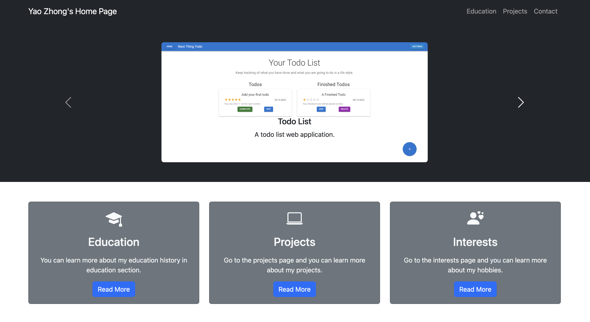
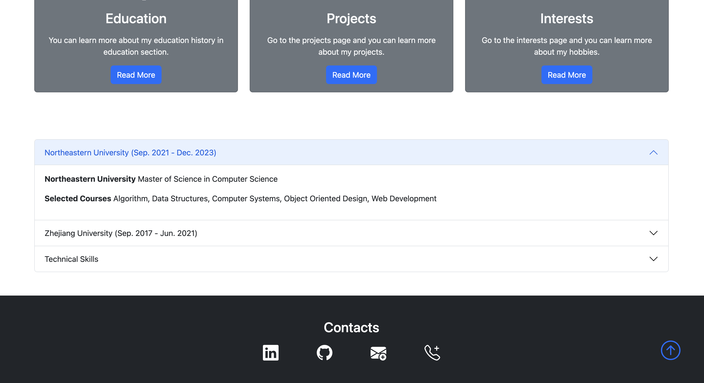
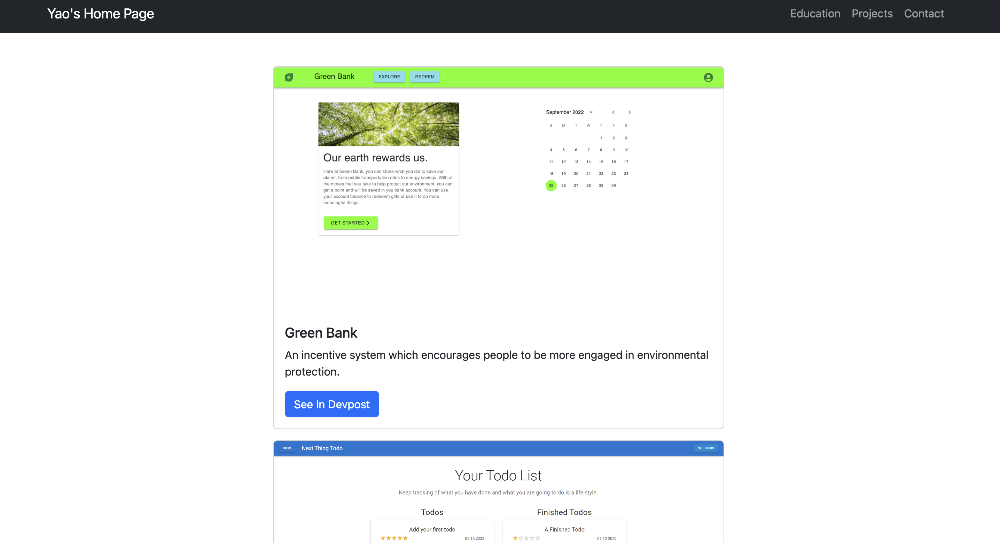

# Yao Zhong Personal Page

## Screen Shot

<table>
    <tr>
        
    <tr>
     <tr>
        
    <tr>
     <tr>
        
    <tr>
</table>

## Project Objective

A personal home page which displays my skills, courses, projects, hobbies, etc.

## Tech Used

html, CSS, Bootstrap 5 and JavaScript

## How to install

Clone this repository and use live server.

## Demo Video

<a href="https://youtu.be/6MHnrJmcmYI">Demo</a>

## Project Link

<a href="https://melancholyzhong.github.io/Yao-Personal-Page/index.html">Site</a>

## Author

Yao Zhong, devin36@gmail.com

## Course

https://johnguerra.co/classes/webDevelopment_fall_2022/
